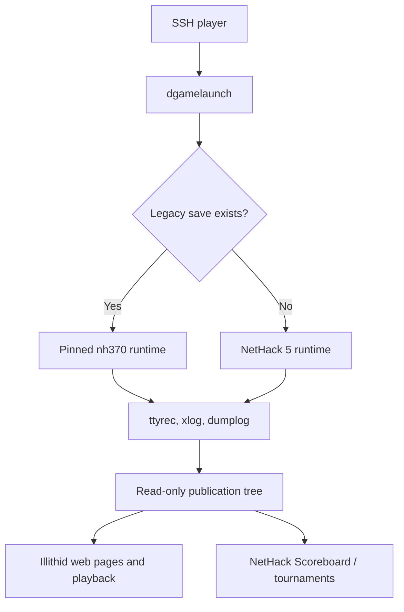

# Illithid Public NetHack Service Modernization Plan

**Status:** Blocked by plan 0001 repository-topology verification
**Prepared:** 2026-08-24  
**Service:** `illithid` / `ssh nethack@floatingeye.net`  
**Purpose:** Bring Illithid to the normal level of service expected from a mature public NetHack server while preserving every recoverable active game.

## 1. Outcome

Illithid will provide:

- a supported current NetHack release as the default game;
- automatic continuation of active games under the exact legacy binary that created them;
- dgamelaunch accounts, menus, live watching, and ttyrec recording;
- public, navigable scores, game details, dumplogs, and ttyrec playback;
- both in-terminal and authenticated web editing of player configuration files;
- stable, read-only xlogfile and dumplog URLs suitable for the NetHack Scoreboard and tournaments;
- monitored, documented, repeatable deployment, backup, restore, and rollback procedures;
- a current supported host platform, preferably introduced by replacement rather than an in-place production upgrade.

The defining safety rule is: **no production cutover is allowed until legacy-save continuation has passed the migration test matrix and a tested rollback exists.**

## 2. Current Baseline and Constraints

The available operations snapshot establishes that Illithid is a production DigitalOcean host with 1 GB RAM and 25 GB disk, observed on Ubuntu 22.04.5 LTS. It runs dgamelaunch and the Floating Eye NetHack 3.7 lineage (`nh370`), and active player games exist. The service start/supervision method and full backup coverage are not yet confirmed.

NetHack 5.0.0 is the current official release as of this plan. Its release notes explicitly state that existing save and bones files are incompatible with 5.0.0. Therefore, saves must not be converted or opened with the new binary. The old and new runtimes must coexist.

Illithid is capacity-constrained and has limited operator redundancy. Prefer static generation, small auditable components, off-host backups, and automation that reduces hand-edited production state.

## 3. Target Service Baseline

| Capability | Minimum acceptable service | Target implementation |
| --- | --- | --- |
| Secure play | Stable SSH endpoint and published host-key fingerprints | Existing public SSH endpoint, hardened and monitored |
| Accounts and menu | Registration, login, game launch, config editing, live watch | dgamelaunch with SQLite account store and reviewed config |
| Current game | Current supported NetHack release | NetHack 5.0 release branch at a reviewed security/bug-fix revision |
| Old saves | Existing games finish without conversion or loss | dgamelaunch `play_if_exist` dispatches an old save to `nh370`; otherwise launches NH5 |
| Recordings | Every session recorded and available for replay | dgamelaunch ttyrec, compressed/archived on a schedule |
| Game artifacts | Public dumplog and xlog for each completed game | Versioned paths with stable HTTPS URLs |
| Local scores | Recent games, top scores, ascensions, player pages | Incrementally generated static HTML from xlogfiles |
| Playback | Browse, download, and play ttyrecs in a browser | Reuse an established ttyrec-compatible web player after a licensing/security spike |
| Configuration | Quick terminal edits plus convenient web editing | DGL editor first; authenticated HTTPS editor with path and size controls second |
| Ecosystem export | NetHack Scoreboard and tournament ingestion | Public append-only xlog endpoints and documented dumplog URL patterns |
| Operations | Backups, restore test, monitoring, logs, capacity alerts | Versioned runbooks, off-host backups, service checks, and alerting |

## 4. Technical Shape

Keep the game runtime, public artifacts, and web presentation separate even if they initially share one host.

Recommended boundaries:

- **Runtime tree:** versioned, immutable releases with an atomic `current` pointer for new games. Preserve the exact legacy executable, data files, configuration, and required shared libraries.
- **Player-state tree:** accounts, saves, locks, rc files, and bones. Never place it directly under the web root.
- **Artifact tree:** xlogfiles, dumplogs, and ttyrecs. A publisher copies or links only approved public artifacts into a read-only web tree.
- **Web tree:** static pages and playback assets. Dynamic code is limited to authenticated rc editing and must run without shell access.
- **Backup tree:** off-host, encrypted where it contains accounts, saves, configs, or other private state.

## 5. Delivery Phases

### Phase 0 — Establish Control and Evidence

**Goal:** Know exactly what is running and make current state recoverable before changing it.

Tasks:

1. Open a dedicated Illithid infrastructure change record and assign one accountable service owner. Track landing-page content in Illithid, web deployment and live verification in `site-ops`, and game/build changes in the appropriate NetHack and dgamelaunch repositories.
2. Capture a read-only inventory:
   - OS/packages, filesystem usage, memory, swap, and inode use;
   - SSH/DNS/TLS endpoints and host-key fingerprints;
   - dgamelaunch source revision, build flags, config, chroot layout, account backend, ownership, and permissions;
   - exact `nh370` commit/build flags, runtime paths, playground paths, save naming, bones pools, rc paths, record/log/xlog/dumplog paths;
   - service start mechanism, supervision, restart policy, log rotation, scheduled jobs, and web-server configuration;
   - count and age of active saves and locks, without copying player contents into Git.
3. Classify every data surface as public, private operational, or secret.
4. Produce a dependency lock/bill of materials for both existing binaries.
5. Freeze unrelated cleanup until the migration is complete.

**Exit gate:** Inventory reviewed; exact active-game count recorded; no unknown process launches the service; no unexplained production configuration drift.

### Phase 1 — Backups, Restore, and Observability

**Goal:** Prove recovery before adding features.

Tasks:

1. Back up, at minimum:
   - dgamelaunch account database and configuration;
   - all save files, lock files, bones, rc files, record/log/xlog files, dumplogs, and ttyrecs;
   - exact old game binary, data files, configuration, chroot content, and required libraries;
   - systemd/inetd/SSH/web configuration and scheduled jobs.
2. Store backups off-host. Encrypt private state; retain checksums and a manifest. Do not publish raw backup paths or contents.
3. Restore the service into an isolated staging environment and prove that a copied legacy save can resume there.
4. Add checks for SSH login, dgamelaunch menu availability, web health, free disk/inodes, backup freshness, certificate expiry, abnormal restart rate, and stale locks.
5. Set ttyrec and dumplog retention rules. Archive older ttyrecs off-host before deleting local copies.

**Exit gate:** A complete restore succeeds from backup; an operator can document recovery time and verify a resumed copied game; alerts are tested.

### Phase 2 — Build a Parallel Current Platform

**Goal:** Create the replacement without disturbing production.

Preferred approach: provision a small replacement/staging droplet on Ubuntu 24.04 LTS, sized after measuring current peak memory and storage growth. Keep the existing host intact through validation and early production soak. If cost prevents a second droplet, use an isolated staging tree on the existing host, but retain the same gates.

Tasks:

1. Build dgamelaunch reproducibly from a pinned revision, with SQLite support if that matches current accounts.
2. Reproduce the exact `nh370` runtime needed for active saves. Do not rebuild it casually if a rebuilt binary or data set could change compatibility.
3. Build NetHack 5 from the maintained 5.0 release line at a reviewed revision that includes relevant post-release fixes. Record source commit, patches, build flags, compiler, and runtime paths.
4. Give NH5 distinct save, bones, record/log/xlog, dumplog, and rc paths. Never share save or bones pools across incompatible versions.
5. Configure dgamelaunch launch order conceptually as:
   - if the user has a legacy save, run the pinned `nh370` game;
   - otherwise run NH5 for new games.
6. Use dgamelaunch's `play_if_exist` command against the exact old-save path, followed by the normal NH5 `play_game` action. Review the final command queue and privilege boundaries in source control.
7. Add a visible menu label explaining that an old game will resume automatically and that new games use NH5.

**Exit gate:** Both binaries run in staging; their writable paths are disjoint; DGL accounts and permissions work; old-save dispatch behaves deterministically.

### Phase 3 — Prove No-Save-Loss Migration

**Goal:** Test the behavior users depend on, including failures and rollback.

Create synthetic saves where possible and use copied production saves only in the isolated staging environment. Preserve originals untouched.

| Test | Expected result |
| --- | --- |
| User with a valid `nh370` save logs in | Old binary starts and the same game resumes |
| User without an old save logs in | NH5 starts a new game |
| User finishes the old game, then launches again | First run completes under `nh370`; next run starts NH5 |
| Old save exists but NH5 path is selected in the menu | Dispatch still prevents NH5 from opening the old save |
| Old runtime fails to start | No save mutation; clear operator-visible error; new game does not start as a fallback |
| DGL/session disconnect during old game | Save remains resumable; lock cleanup matches current safe behavior |
| Server restarts during each game version | Recovery behavior is documented and save remains usable where NetHack supports it |
| Simultaneous login for one account | No concurrent access corrupts the save |
| Username edge cases and path traversal attempts | No access outside the user's approved paths |
| Old game ends in death/quit/escape/ascension | Correct legacy xlog, dumplog, score, and ttyrec are written once |
| NH5 game ends | Correct NH5 artifacts are written once and are distinguishable by version |
| Rollback to old production service | Accounts and untouched saves remain usable; no reverse migration is required |

Run the matrix with at least one real copied save for each distinct legacy save format/build found in inventory. Compare hashes before and after failed-launch tests. Have a second reviewer inspect evidence if possible.

**Exit gate:** Every critical test passes; failures do not mutate saves; backup restore and service rollback are rehearsed; the service owner explicitly approves cutover.

### Phase 4 — Production Cutover and Soak

**Goal:** Make NH5 the default for new games while keeping legacy continuation invisible and safe.

Tasks:

1. Announce the maintenance window and the exact user-visible behavior.
2. Stop new sessions cleanly, confirm no active game processes, and take a fresh verified backup.
3. Deploy versioned releases and the reviewed DGL configuration. Do not delete or transform old saves or bones.
4. Run smoke tests with test accounts for legacy resume, NH5 new game, ttyrec, xlog, dumplog, and rc edit.
5. Reopen the service and monitor logins, launch failures, stale locks, disk, and artifacts closely for at least seven days.
6. Keep the old host/release and rollback instructions intact through the soak period.

**Exit gate:** No unexplained launch/save incidents during soak; all active legacy games remain reachable; NH5 is stable for new games.

### Phase 5 — Public Web Features

**Goal:** Reach the user-facing baseline without placing private game state at risk.

Deliver in this order:

1. **Public service page:** connection command, host-key fingerprints, supported versions, status, news, rules, privacy/recording notice, contact, and links to scores/artifacts.
2. **Local scoreboard:** generate static pages incrementally from xlogfiles—recent games, top scores, ascensions, player pages, and game detail links. Treat xlog as the canonical event feed; do not scrape terminal output.
3. **Dumplogs:** publish stable per-game URLs and link them from game listings.
4. **Ttyrec browser/player:** publish an index with player/date/version metadata, download links, and a client-side player. First evaluate reuse of the current Hardfought/NAO-compatible player or another maintained ttyrec player for license, UTF-8/curses correctness, compressed-file handling, large-file behavior, and dependency risk.
5. **RC editing:** retain the dgamelaunch menu editor. Add a web editor only after implementing HTTPS, DGL-compatible authentication, CSRF protection, login throttling, strict per-user path mapping, symlink rejection, file-size limits, atomic writes, backup-on-save, and audit events. Never expose the DGL database or password hashes to the web root.
6. **Accessibility and mobile:** keyboard-operable controls, readable contrast, clear playback controls, and narrow-screen layouts.

**Exit gate:** Web pages disclose no private account/save data; scores match sampled xlog entries; every sampled playback and dumplog link works; rc edits cannot cross account or version boundaries.

### Phase 6 — Ecosystem Integration

**Goal:** Make Illithid consumable by established community services rather than creating a private interchange format.

Tasks:

1. Publish stable, read-only HTTPS URLs for each supported variant/version xlogfile.
2. Document server code, variant/version identifiers, timezone/UTC behavior, field definitions, dumplog URL pattern, and retention policy.
3. Validate xlog lines for required fields, escaping, uniqueness, and one-line-per-finished-game behavior. Add regression fixtures from real completed test games.
4. Contact the NetHack Scoreboard maintainers to register Illithid as a source and supply the xlog and dumplog patterns. Confirm ingested sample games and correct links.
5. For Junethack or another federated event, coordinate server registration and variant mapping before the event; do not assume that publishing xlog alone enrolls the server.
6. For TNNT, treat participation as a separate tournament project. TNNT uses its own game fork and centralized backend/configuration; coordinate with the TNNT team rather than trying to emulate its database protocol.

**Exit gate:** The public feed is stable; sample games appear correctly on the external scoreboard; an integration contact and revalidation procedure are documented.

### Phase 7 — Operationalize and Improve

**Goal:** Keep the service at that level.

Tasks:

1. Write runbooks for deploy, rollback, restore, account recovery, stale locks, disk pressure, broken ttyrecs, scoreboard lag, certificate/host-key changes, and security incidents.
2. Automate daily backups, artifact publication, static score generation, ttyrec archival, link checks, and feed validation.
3. Run a monthly restore sample and quarterly full recovery rehearsal.
4. Review NetHack, dgamelaunch, OS, web-player, and dependency security updates monthly; stage and regression-test before production.
5. Publish planned maintenance and incidents. Retain a concise internal change record with evidence and residual risks.
6. After all legacy saves are gone, obtain explicit approval before retiring `nh370`. Archive its release and final private backup; remove public launch paths in a separate change.

## 6. Work Packages and Ownership

| Work package | Accountable role | Primary repository/record | Completion evidence |
| --- | --- | --- | --- |
| Host inventory and replacement | Illithid service owner | Dedicated infrastructure plan | Reviewed inventory and build record |
| DGL and multi-version dispatch | Game service maintainer | dgamelaunch/config source | Migration test report |
| NH5 build and legacy runtime | NetHack maintainer | NetHack/build source | Reproducible build manifest |
| Backup, restore, monitoring | Site operations | `site-ops` plus private receipts | Restore report and alert tests |
| Public-site content | Illithid service owner | `illithid/site/illithid.floatingeye.net/` | Reviewed static source and service claims |
| Public-site and artifact deployment | Site operations | `site-ops` | Backup-gated deployment and live verification record |
| Score generator/player/editor | Web maintainer | Reviewed public code repository | Automated tests and security review |
| External scoreboard/tournament | Service owner | Integration record | Confirmed ingestion |
| Closure | Service owner/approver | Change record | Acceptance criteria met and explicit approval |

Role separation is preferred, but the same person may hold several roles. In that case, require an explicit checklist review and seek an external peer review for the save-migration and web-authentication changes.

## 7. Priority and Indicative Schedule

For a part-time sole maintainer, plan approximately 8–12 weeks of focused work, excluding the time legacy players take to finish games.

| Priority | Work | Indicative elapsed time |
| --- | --- | --- |
| P0 | Inventory, verified backup/restore, monitoring | Weeks 1–2 |
| P0 | Parallel host, pinned runtimes, DGL dispatch | Weeks 2–4 |
| P0 | Migration matrix and rollback rehearsal | Weeks 4–5 |
| P1 | Controlled cutover and seven-day soak | Weeks 6–7 |
| P1 | Local scores, dumplogs, public xlog | Weeks 7–8 |
| P1 | Ttyrec browsing/playback and archival | Weeks 8–9 |
| P2 | Hardened web rc editor | Weeks 9–10 |
| P2 | External scoreboard/tournament onboarding | Weeks 10–12 |

If capacity is tight, stop after P1 with terminal rc editing. Safe current play, recoverability, scores, dumplogs, ttyrecs, and public xlog provide most of the public-server value; the web rc editor is useful but introduces the largest new authentication surface.

## 8. Principal Risks and Controls

| Risk | Control |
| --- | --- |
| NH5 opens or destroys an incompatible old save | Disjoint paths; `play_if_exist`; old binary first; failure must stop, never fall through |
| Rebuilt legacy runtime is subtly incompatible | Preserve exact binary/data/libs; test each observed save format using copies |
| Cutover loses accounts or active state | Quiesced snapshot, checksum manifest, tested restore, retained old host |
| Web server exposes saves/accounts | Separate publication tree, allowlist copier, read-only permissions, directory-listing tests |
| Web rc editor enables account takeover or file writes | Defer until threat review; HTTPS, throttling, CSRF, strict path mapping, atomic bounded writes |
| Ttyrecs fill the 25 GB disk | Capacity alerts, compression, daily off-host archive, documented retention |
| Scoreboard double-counts or misses games | Append-only xlog, stable server/version IDs, fixtures, incremental offsets, reconciliation job |
| One operator becomes a continuity bottleneck | Reproducible builds, runbooks, peer review, recovery drills, off-host records |
| OS upgrade and game migration fail together | Blue-green replacement; do not combine irreversible changes on the live host |

## 9. Final Acceptance Criteria

The modernization is complete only when all of the following are true:

1. Every legacy save found at baseline either resumes under the pinned legacy runtime or has a documented, owner-approved exception; none is opened by NH5.
2. A user with no legacy save starts NH5 by default.
3. Backup restoration has been demonstrated on an isolated host, including one resumed legacy game.
4. SSH, DGL, both game runtimes, locks, ttyrecs, xlogs, dumplogs, scores, and rollback pass documented tests.
5. Public pages expose no account database, saves, secrets, private configs, or unintended directory listings.
6. Recent games, scores, dumplogs, and ttyrecs are navigable over HTTPS and sampled entries agree with source xlogs.
7. Illithid's stable xlog source is successfully ingested by the NetHack Scoreboard or a documented external blocker has been accepted.
8. Monitoring and off-host backup freshness are visible and tested.
9. Deployment, rollback, restore, and incident runbooks are current.
10. The accountable service owner reviews the evidence and explicitly approves closure. Passing tests alone does not retire the old runtime.

## 10. Immediate Next Actions

1. Perform the Phase 0 read-only inventory and record the active-save count.
2. Confirm current backup coverage and run the first isolated restore.
3. Decide whether to fund a temporary replacement/staging droplet; this is the recommended path.
4. Capture the exact DGL config and `nh370` runtime needed to design the `play_if_exist` rule.
5. Create the migration fixtures and test report template before building NH5.
6. Open separate implementation tickets for the public scoreboard, ttyrec player, rc editor, and external feed; do not couple their release to save migration.

## References

- [NetHack 5.0.0 release notes](https://nethack.org/v500/release.html) — current release and explicit save/bones incompatibility.
- [Official NetHack source](https://github.com/NetHack/NetHack) — release source and maintained branches.
- [dgamelaunch source](https://github.com/paxed/dgamelaunch) — DGL, ttyrec support, configuration, and `play_if_exist` history.
- [NetHack Scoreboard source](https://github.com/nethackscoreboard-org/matter) — public xlog feeder and static statistics generator architecture.
- [Hardfought NetHack service](https://www.hardfought.org/nethack/) — mature public-server feature reference.
- [Hardfought ttyrec archive](https://www.hardfought.org/nethack/ttyrecs/) — browse/playback/archive model.
- [Hardfought RC editor](https://www.hardfought.org/nethack/rcedit/) — authenticated web editing model.
- [The November NetHack Tournament](https://tnnt.org/) and [TNNT backend](https://github.com/tnnt-devteam/python-backend) — tournament-specific centralized operation and telemetry.
- [NetHack Scoreboard Matter README](https://github.com/nethackscoreboard-org/matter#readme) — server feed ingestion details.
