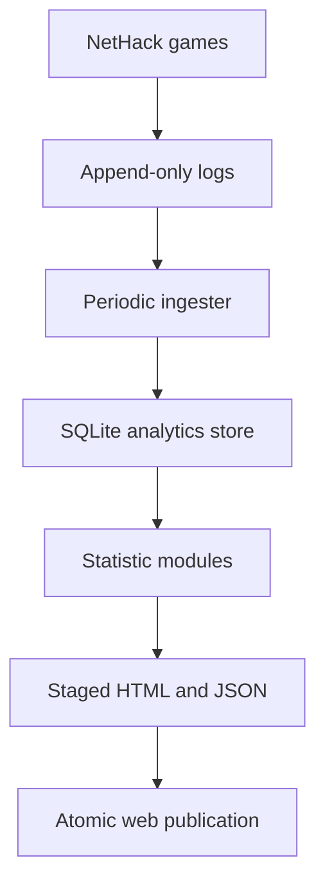

# Proposal: Illithid Living Statistics Infrastructure

**Status:** Proposed  
**Scope:** Gameplay data generated by the Floating Eye NetHack variant on Illithid  
**Primary goal:** Make it easy to invent, test, and publish fun and surprising statistics from real games  
**Out of scope for the initial system:** Universal cross-variant normalization and comprehensive coverage of every NetHack variant

## 1. Summary

Illithid should gain a small, durable analytics pipeline that turns gameplay records into regularly updated public statistics pages. NetHack will continue to write ordinary game records and will additionally emit selected structured events. A scheduled process on Illithid will ingest new records into a local analytical database. Independent statistic modules will query that database and generate static HTML and JSON into a dedicated section of the Illithid website.

The proposed first architecture is deliberately modest:

- append-only raw game and event logs;
- periodic, idempotent ingestion into SQLite;
- versioned statistic definitions expressed primarily as SQL;
- nightly static-page generation, with optional more frequent builds later;
- atomic publication that leaves the last successful pages online after a failure;
- no database or web request in the gameplay process;
- no dependency on save-file inspection or modification;
- no attempt to solve cross-variant equivalence yet.

The system is not intended to begin with a fixed catalogue of all possible statistics. Its product is the **ability to add new questions cheaply**. A statistic should be a small, reviewable unit consisting of a question, a query or calculation, explanatory metadata, tests, and a presentation template.

## 2. Motivation

NetHack servers traditionally publish high scores, dumplogs, ttyrecs, and `xlogfile` records. These answer important questions, but they do not create an exploratory statistical surface. Illithid could provide something more playful and distinctive: pages devoted to questions that arise from the game and its community.

Examples include:

- What do floating eyes observe players wearing or doing?
- How often is a blindfold already being worn when a floating eye is encountered?
- Which deaths happen shortly after completing Sokoban or acquiring a major resistance?
- What is the distribution of ascensions per player, and how strongly do prolific outliers affect the mean?
- Which roles spend the greatest fraction of their games burdened?
- What objects are most often carried but never used?
- What unusual combinations of conduct, equipment, and dungeon progress recur?
- Which apparent “good signs” are actually associated with bad outcomes after controlling for game depth?

The system should support both serious descriptive work and statistics whose main purpose is delight. Every page should still state what was measured, over what population, and with what limitations.

## 3. Goals

### 3.1 Functional goals

1. Collect structured facts from completed and in-progress games without affecting mechanics or player decisions.
2. Preserve an immutable or reconstructable raw record of emitted data.
3. Ingest new records repeatedly without duplication.
4. Make new statistics inexpensive to implement and publish.
5. Support aggregate server statistics first and player-facing records later.
6. Show the data cutoff, sample size, definition, and important caveats on every page.
7. Permit historical recalculation when a query, interpretation, or schema improves.
8. Support the floating-eye dossier as one consumer of the same infrastructure.

### 3.2 Operational goals

1. Add no network or database dependency to the NetHack game process.
2. Preserve active games, save compatibility, dgamelaunch operation, and existing logs.
3. Fit comfortably on Illithid’s small production host.
4. Keep the public website available when ingestion or page generation fails.
5. Make the complete derived database and website rebuildable from retained source records.
6. Back up the new raw data and configuration through an explicitly verified process.

## 4. Non-goals

The first release will not:

- normalize every NetHack variant;
- translate bones between variants;
- provide second-by-second live dashboards;
- run arbitrary public queries against the production database;
- infer every player action from ttyrecs;
- scrape active save files;
- introduce machine learning merely for its own sake;
- claim causal relationships from observational correlations;
- replace existing dumplogs, ttyrecs, scoreboards, or `xlogfile` publication.

Bonegraft and a future universal entity ontology remain related projects, but Illithid statistics should be useful before those problems are solved.

## 5. Proposed architecture



### 5.1 Gameplay data production

The game process should only append records to local files. It must not connect to SQLite, invoke analytical code, render pages, or call a web service. This keeps analytics failure outside the gameplay failure domain.

Two data streams are proposed:

1. **Game summaries:** Existing `xlogfile` data, with a stable game identifier added if one is not already available reliably.
2. **Event records:** A new append-only event log for facts that cannot be reconstructed from the final game summary.

The event log should use a simple, versioned, line-oriented format. A tab-delimited `key=value` format is compatible with NetHack’s existing logging conventions and is easy to append from C. JSON Lines is also viable if correct encoding is implemented centrally. The exact encoding matters less than these properties:

- one self-contained event per line;
- explicit schema version;
- stable event and game identifiers;
- sequence number within a game where practical;
- safe escaping of player-controlled text;
- forward-compatible optional fields;
- no secrets, IP addresses, passwords, terminal contents, or save-file data.

A typical event needs a small typed envelope:

| Field | Purpose |
| --- | --- |
| `schema_version` | Interpretation of the record |
| `event_id` | Globally unique or deterministically unique ingestion key |
| `game_id` | Joins events to one game summary |
| `event_seq` | Establishes order within a game |
| `event_type` | Stable event name such as `floating_eye_observation` |
| `recorded_at` | Server timestamp |
| `turn` | In-game turn number where applicable |
| `player` | Public game identity, separated from private account data |
| `game_version` | Exact build or ruleset identifier |
| `dungeon_context` | Branch, level, coordinates, or depth where relevant |
| event payload | Fields specific to that event type |

Instrumentation should record facts, not precomputed conclusions. For example, a floating-eye encounter record can state that the hero was blind, blindfolded, carrying a silver shield, and had reflection. The analytical layer can later decide how to group and present those facts.

### 5.2 Raw-data spool and retention

Raw logs are the rebuild source and should be treated as append-only operational records.

- Use a dedicated directory with permissions limited to the game writer and ingestion service.
- Rotate logs on a predictable schedule without truncating records still being written.
- Compress closed files after ingestion.
- Record checksums or equivalent integrity metadata for closed files.
- Back up raw records separately from derived HTML and the rebuildable database.
- Define a retention policy only after measuring actual growth; do not discard the earliest data casually.

The initial deployment must verify disk capacity, log rotation, and backup coverage. Illithid is a production dgamelaunch host with active games, not a disposable analytics machine.

### 5.3 Periodic ingestion

An ingestion command should run from a systemd timer or cron. A cadence between five minutes and one hour is sufficient initially; fifteen minutes is a reasonable default. Page publication can remain nightly even when ingestion is more frequent.

The ingester will:

1. Discover new or extended raw files.
2. Resume from recorded file/offset checkpoints.
3. Parse and validate complete records.
4. Insert records transactionally.
5. Ignore already-seen `event_id` and game-summary identities.
6. Quarantine malformed records without blocking later valid records.
7. Record ingestion time, source file, schema version, and validation result.
8. Emit an operational summary including accepted, duplicate, rejected, and delayed records.

Ingestion must be safely repeatable. Restarting a failed job or replaying an archived file must not double-count events.

### 5.4 Analytical database

SQLite is recommended for the first implementation because it is operationally small, transactional, easy to back up, and sufficient for one writer plus scheduled analytical readers. The workload does not initially justify PostgreSQL or a streaming platform.

The database should use typed core tables and retain flexible event payloads:

- `games`: one row per game, normalized from `xlogfile`;
- `events`: common event envelope plus a structured payload;
- `players`: public player identity and display metadata, without authentication secrets;
- event-specific derived tables or views for frequently used event types;
- `ingest_sources`: file checkpoints and ingestion history;
- `stat_runs`: statistic version, data cutoff, execution status, row counts, and output identity.

SQLite WAL mode may be useful, but the implementation should avoid serving unpredictable public queries against the live database. Statistic jobs should have bounded resource use, appropriate indexes, and timeouts. If data volume eventually exceeds the comfortable SQLite range, the raw-log and statistic-module interfaces should permit migration without changing game instrumentation.

### 5.5 Statistic modules

Each published statistic should be an independently reviewable module. A suggested layout is:

```text
statistics/
  floating-eye-blindfolds/
    statistic.yaml
    query.sql
    transform.py        # optional
    explanation.md
    template.html
    tests/
```

`statistic.yaml` should identify:

- stable slug and title;
- the question being answered;
- input tables and required schema versions;
- population and denominator;
- exclusions and minimum sample size;
- calculation version;
- update cadence;
- public/private status;
- expected output files;
- short interpretation and caveats.

SQL should perform most selection and aggregation. A small Python transformation can handle confidence intervals, unusual reshaping, chart data, or prose generation when SQL alone would be awkward. Statistic modules must not mutate raw or normalized data.

This structure turns a new curiosity into a small addition rather than a new application. A statistic can be experimental, reviewed, published, revised, or retired without destabilizing the rest of the site.

### 5.6 Page generation and publication

Static generation is recommended before on-demand dynamic pages.

- Run a complete site build nightly after ingestion.
- Permit manual rebuilds for development and correction.
- Later, rebuild selected inexpensive pages hourly if freshness is valuable.
- Generate both human-readable HTML and machine-readable JSON summaries.
- Build into a staging directory.
- Validate required pages, links, metadata, and output sizes.
- Publish by an atomic directory or symlink swap into a dedicated `/stats/` subtree.
- Leave the last successful build untouched if any required step fails.

Every statistics page should display:

- the question;
- the answer or visualization;
- data through a precise timestamp;
- sample size and denominator;
- applicable game build or time range;
- a plain-language method;
- significant exclusions and caveats;
- calculation version or revision date.

The existing Illithid landing page is deployed separately to its Apache root. Statistics publication should own only its registered subtree so that a failed or overly broad deployment cannot erase the landing page.

Dynamic pages can be considered later for player search, adjustable filters, or authenticated personal views. They should consume a read-only snapshot or generated API data rather than opening unrestricted access to the ingestion database.

## 6. Data quality and statistical integrity

Fun statistics still require explicit definitions. The infrastructure should make misleading calculations harder to publish accidentally.

### 6.1 Denominators

Pages must distinguish among:

- all games;
- non-scummed games;
- games reaching a specified stage;
- games in which an object or condition was observed;
- unique players;
- events or encounters;
- ascensions only.

“Carried in 20% of ascensions” and “20% ascension rate after acquisition” are entirely different statements.

### 6.2 Observational limitations

Statistics from gameplay are usually associations, not causal effects. An item associated with ascension may simply be found late in successful games. Pages should condition on dungeon depth, game stage, experience, or other obvious confounders when the question requires it, and should avoid causal language unless a design genuinely supports it.

### 6.3 Versioning and provenance

Every raw record, derived calculation, and page build should retain enough provenance to answer:

- Which NetHack build produced this record?
- Which event schema interpreted it?
- Which statistic definition calculated the result?
- What data cutoff was used?
- Can the page be reproduced from retained inputs?

Schema changes should add a new version rather than silently changing the meaning of old fields.

### 6.4 Small samples

Pages should show sample sizes and suppress or clearly label fragile comparisons. Statistics about rare combinations can inadvertently identify individual players even when names are omitted. A configurable minimum cohort size should apply to public comparisons, with specific review for deliberately player-facing records.

## 7. Privacy and player expectations

Public NetHack play already produces visible outcomes, but richer telemetry changes the degree of observation. Illithid should state plainly that gameplay events may be used for public aggregate statistics.

The system should:

- collect game facts, not terminal text or unrelated account activity;
- exclude network identifiers, credentials, email addresses, private configuration, and save contents;
- separate public nicknames from private dgamelaunch account records;
- define which statistics are aggregate, named, private-to-player, or opt-in;
- provide a policy for correcting or removing an erroneous public player association;
- review new event types before collection, not merely before publication;
- avoid publishing fine-grained timelines that unnecessarily reconstruct an individual’s activity.

The floating-eye dossier is intentionally player-specific and should receive its own visibility decision. Aggregate floating-eye statistics can be launched first.

## 8. Reliability and security controls

The analytics path must remain downstream from gameplay.

- Game logging failure should degrade gracefully and should never corrupt a save.
- The ingester runs without permission to edit saves or game binaries.
- The page generator receives read-only database access where practical.
- Generated text is escaped before HTML publication.
- Public URLs and slugs come from reviewed metadata, not player-controlled strings.
- Query runtimes and output sizes are bounded.
- A failed ingest or statistic build raises an operational alert or visible status without removing the last good site.
- Raw logs, database backups, and generated pages have separate recovery procedures.
- Deployment must not use a broad destructive synchronization against the entire Apache document root.

Before implementation on the live host, current dgamelaunch supervision, disk use, backups, and recovery procedures must be verified. The analytics project should not be coupled to the separate Ubuntu upgrade until both changes have independent rollback plans.

## 9. Suggested first statistics

The first release should include a small set that exercises different parts of the pipeline:

1. **Server pulse:** games, players, deaths, ascensions, turns, and real time by day or week.
2. **The average NetHack player:** distribution of games and ascensions per player, including median, percentiles, and the influence of outliers.
3. **Floating-eye observations:** encounter counts and selected observable states, beginning with blindness, blindfolds, reflection, and silver shields.
4. **Where promising games end:** deaths after selected milestones, grouped by cause and elapsed turns.
5. **Character-combination explorer:** attempts and outcomes by role, race, gender, and alignment where sample sizes permit.

The first three are especially useful because they connect the original “NetHack Analytics” idea with the new Floating Eye dossier work.

## 10. Implementation phases

### Phase 0: Production reconnaissance and design freeze

- Verify current `xlogfile`, dumplog, web-root, dgamelaunch, rotation, backup, disk, and service-supervision arrangements.
- Inventory existing fields without copying private player data into a development repository.
- Choose the stable `game_id` construction and event encoding.
- Write the initial event-schema and privacy notes.
- Capture tested rollback procedures.

**Exit condition:** The design can be deployed without touching active saves or changing gameplay mechanics.

### Phase 1: Existing-data pipeline

- Implement idempotent `xlogfile` ingestion.
- Create the SQLite schema and migration mechanism.
- Build a command-line site generator.
- Publish server pulse and ascension-distribution pages.
- Add build metadata, health reporting, and atomic deployment.

**Exit condition:** The database and pages can be deleted and rebuilt from retained source records, and the last good pages survive a failed build.

### Phase 2: Structured gameplay events

- Add the minimal event-log writer to the Floating Eye NetHack branch.
- Begin with `game_started`, selected milestones, and `floating_eye_observation`.
- Validate logging overhead and malformed-record behaviour.
- Add aggregate floating-eye pages.

**Exit condition:** Event logging has no measurable gameplay disruption and event ingestion is duplicate-safe.

### Phase 3: Statistic-module framework

- Establish the statistic metadata format, tests, templates, and registry.
- Add several genuinely different calculations.
- Document the process for proposing and publishing a new statistic.
- Add selective hourly rebuilds only if nightly freshness proves inadequate.

**Exit condition:** A new statistic can be added without modifying the core ingester or deployment code.

### Phase 4: Player pages and dossiers

- Define player identity and visibility rules.
- Generate personal high scores and conventional records.
- Add the floating-eye dossier as a separate thematic view.
- Consider authenticated or opt-in private detail if useful.

**Exit condition:** Player-facing pages have explicit privacy behaviour and cannot expose private account data.

## 11. Repository and ownership recommendation

The concerns should remain separated:

- The **NetHack repository** owns event definitions at the point of gameplay and the C code that emits them.
- A dedicated **NetHack Analytics** or **Illithid Statistics** repository should own ingestion, schema migrations, statistic modules, tests, and site generation.
- **Site Ops** owns registration of the `/stats/` public surface, deployment procedure, backup integration, and operational documentation.
- The **Illithid host configuration** owns timers, service users, permissions, runtime paths, and secrets.

Bonegraft need not be a dependency. A future canonical entity vocabulary can be adopted through versioned mappings when object-level or cross-variant work justifies it.

## 12. Acceptance criteria for the initial release

The first release is acceptable when:

- existing and active NetHack games are unaffected;
- source records are append-only and schema-versioned;
- ingestion is transactional, restartable, and duplicate-safe;
- malformed records are quarantined and reported;
- the derived database is rebuildable from retained inputs;
- at least two statistics pages are generated and updated nightly;
- each page displays data cutoff, denominator, sample size, and method;
- publication is atomic and retains the last successful build after failure;
- the statistics subtree cannot overwrite the main Illithid landing page;
- raw data, database state, configuration, and recovery procedures have verified backup coverage;
- adding another SQL-based statistic does not require changing game code or the core ingester.

## 13. Recommended decision

Approve a single-server, single-variant Illithid analytics project using append-only game/event logs, scheduled SQLite ingestion, modular statistic definitions, and nightly static publication.

Begin with existing `xlogfile` data and the original ascension-distribution question. Add a narrowly designed gameplay event log next, with floating-eye observations as its first distinctive use. Treat real-time dynamic pages, universal variant support, and large-scale object analytics as later options rather than prerequisites.

This architecture creates room for curiosity. It does not require the final questions to be known in advance, and it keeps experimentation safely downstream from the production game.

